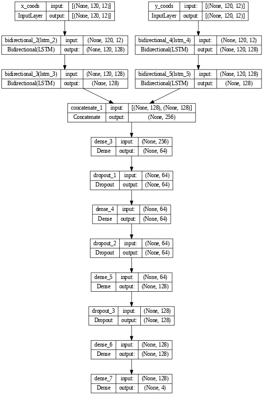

# lstm Network and pre processing

## Preprocessing

### Current data array format 
(number_of_videos, MAX_FRAMES, 12)
MAX_FRAMES = Number of frames we are extracting from a video - currently 60 (first 2 seconds)
If the video length is less than that, rest will be padded with 0

This stores the values of only 1 axis

Example
```
[[[0.66700304 0.38549647 0.69687557 ... 0.31714809 0.70356679 0.32922107]
  [0.66738576 0.38543391 0.69693828 ... 0.31682742 0.70419276 0.32908466]
  [0.66762817 0.38534766 0.6966669  ... 0.31656739 0.70429695 0.32903698]
  ...
  [0.         0.         0.         ... 0.         0.         0.        ]
  [0.         0.         0.         ... 0.         0.         0.        ]
  [0.         0.         0.         ... 0.         0.         0.        ]]

 [[0.62229884 0.3480891  0.65045732 ... 0.30579478 0.60797477 0.31371033]
  [0.61624092 0.34654436 0.64375281 ... 0.30989468 0.59658146 0.31687263]
  [0.61363035 0.34609547 0.64144003 ... 0.31263244 0.59272683 0.31916299]
  ...
  [0.         0.         0.         ... 0.         0.         0.        ]
  [0.         0.         0.         ... 0.         0.         0.        ]
  [0.         0.         0.         ... 0.         0.         0.        ]]
 ...
 [[0.63236445 0.33421081 0.66943514 ... 0.29162601 0.62727934 0.30020961]
  [0.62677479 0.32773796 0.66365469 ... 0.28548938 0.61683559 0.29453629]
  [0.62569523 0.32476041 0.66300368 ... 0.28431934 0.61249614 0.29340574]
  ...
  [0.         0.         0.         ... 0.         0.         0.        ]
  [0.         0.         0.         ... 0.         0.         0.        ]
  [0.         0.         0.         ... 0.         0.         0.        ]]]
```

  Need to have two of those

  Check ```model_code.ipynb``` for more information


  Todo:
  store each video file's coodinates in a csv file

  eg: ```break_1.csv```

    point1_x,point1_y,point2_x,point2_y,point3_x,point3_y
    x1,y1,x2,y2,x3,y3
    x1,y1,x2,y2,x3,y3
    x1,y1,x2,y2,x3,y3

### input of preprocessing script - folder with all videos names as 
```
...
src_original/break_29.avi  
src_original/break_30.avi  
....
```

### output of preprocessing script - set of csv files as mentioned above 
```
...
src_original/break_29.csv  
src_original/break_30.csv  
....
```

## Model

Currently network takes two inputs, x and y a
Overall architecture looks like as follows 

